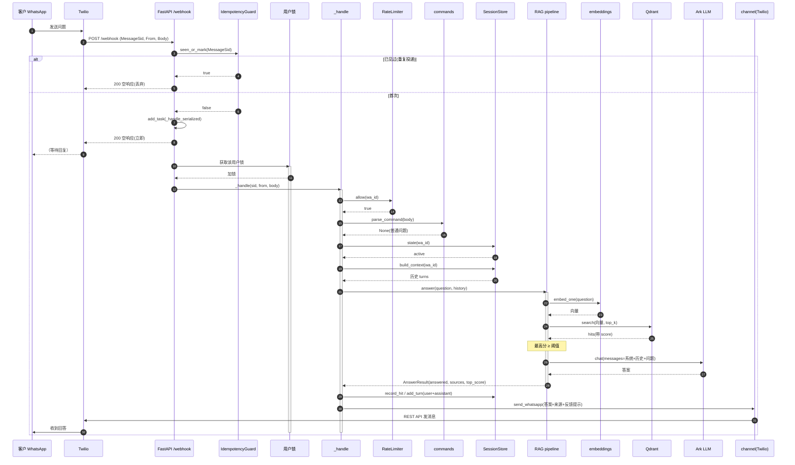
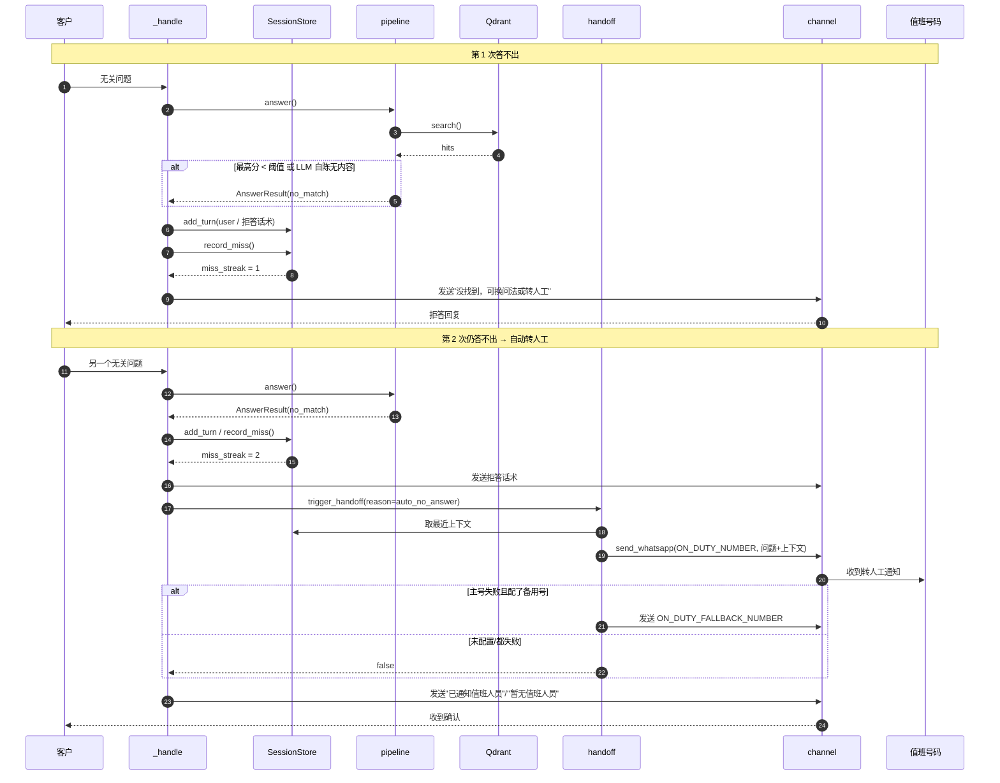
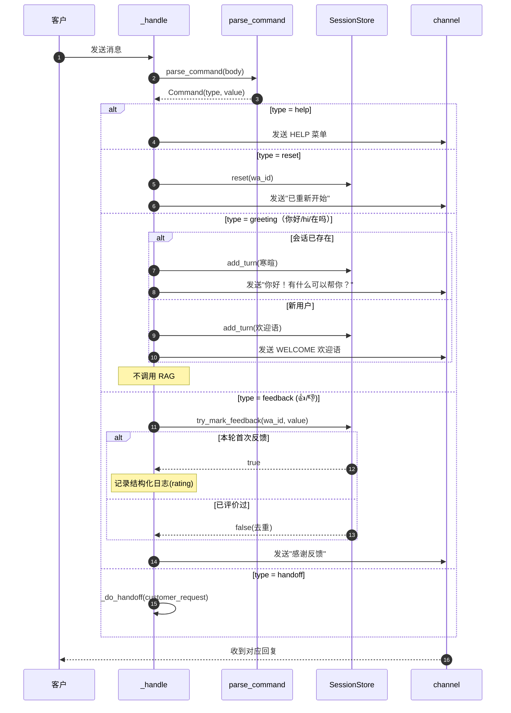
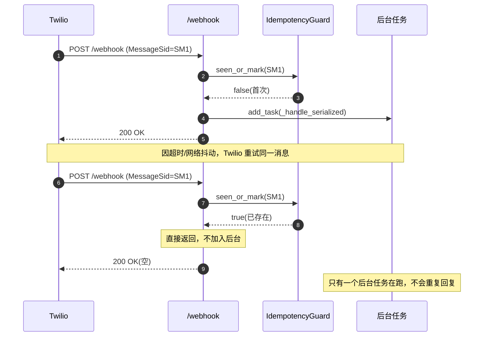
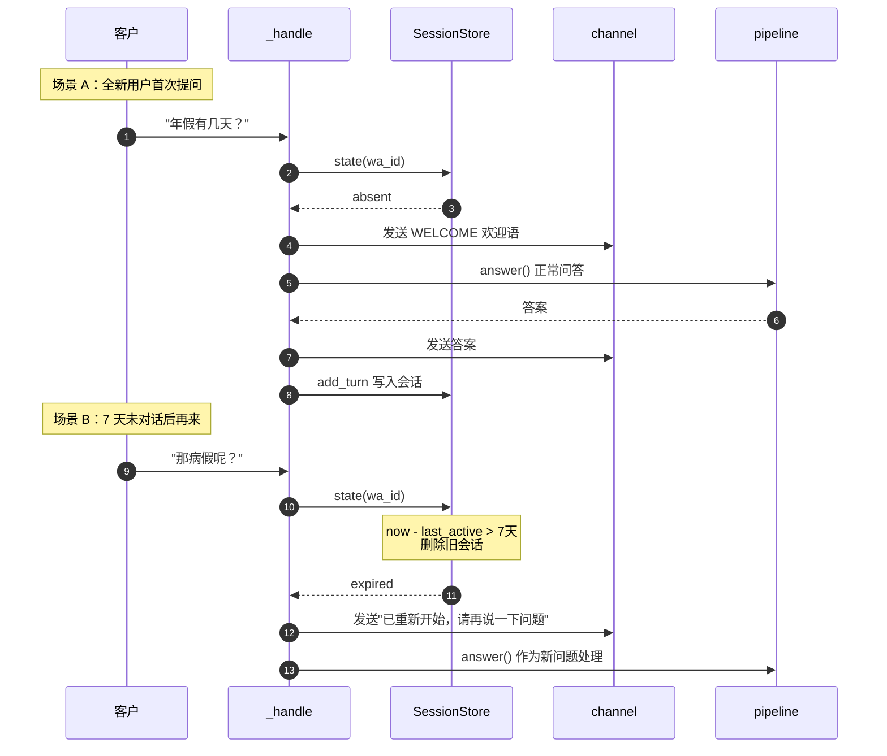
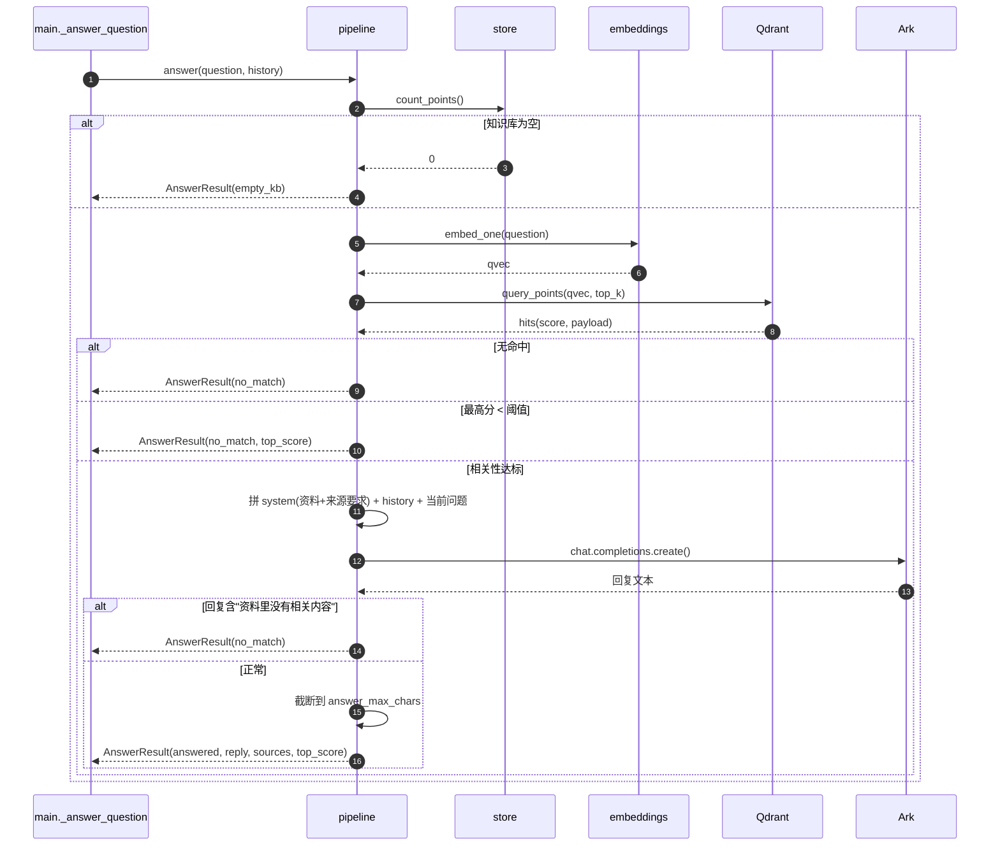
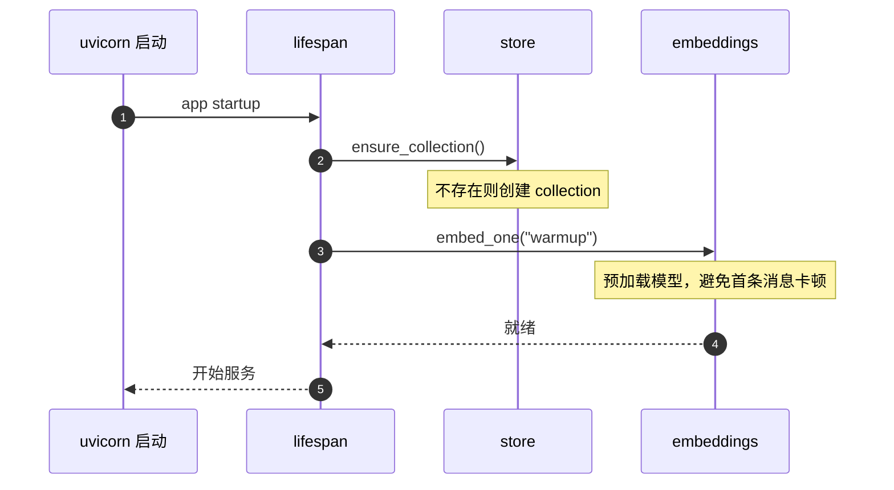

# WhatsApp 企业知识问答助手 — 时序图

本文档基于当前代码（`app/main.py`、`app/rag/pipeline.py`、`app/handoff.py` 等）绘制核心流程的 Mermaid 时序图，便于快速理解系统行为。

- 同步阶段（webhook 内立即执行）：幂等检查，然后立即返回 HTTP 200。
- 后台阶段：同一用户在**用户锁内串行**处理：长度→限流→指令→会话→RAG→回发。

---

## 1. 主流程：正常问答（命中知识库）

---

## 2. 无答案：拒答 + 连续 2 次自动转人工

---

## 3. 指令分支（帮助 / 重置 / 问候 / 反馈）

---

## 4. 重复投递幂等（Twilio 重试）

---

## 5. 新用户欢迎与会话过期

---

## 6. RAG 内部时序（pipeline.answer）

---

## 7. 启动流程（lifespan）

---

## 关键设计要点

- **webhook 立即 200**：所有耗时操作（检索/LLM/回发）都在后台，避免 Twilio 超时重试。
- **同步幂等**：MessageSid 检查在加入后台任务之前完成，杜绝重复回复。
- **用户级串行锁**：同一用户的消息排队处理，防止并发导致重复欢迎语、会话错乱。
- **两道拒答防线**：检索分数低于阈值不调 LLM；LLM 自陈无内容也按拒答处理。
- **单 worker**：会话/幂等/限流都在进程内存，必须 `--workers 1`。
