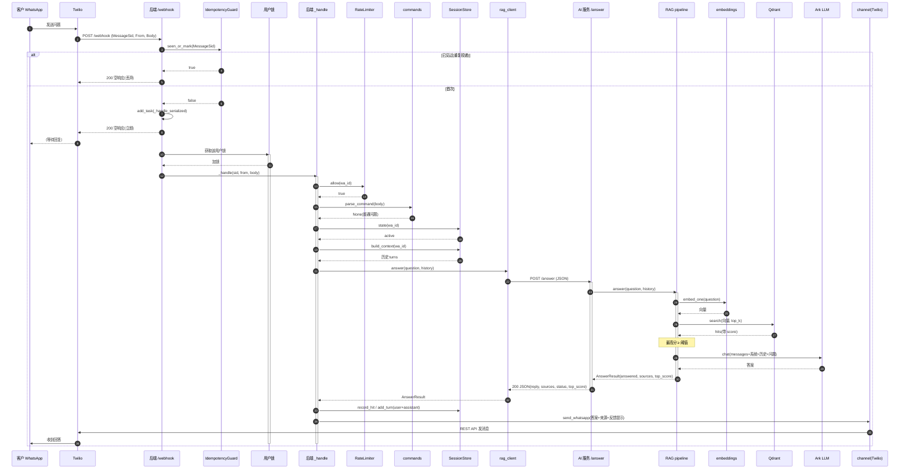
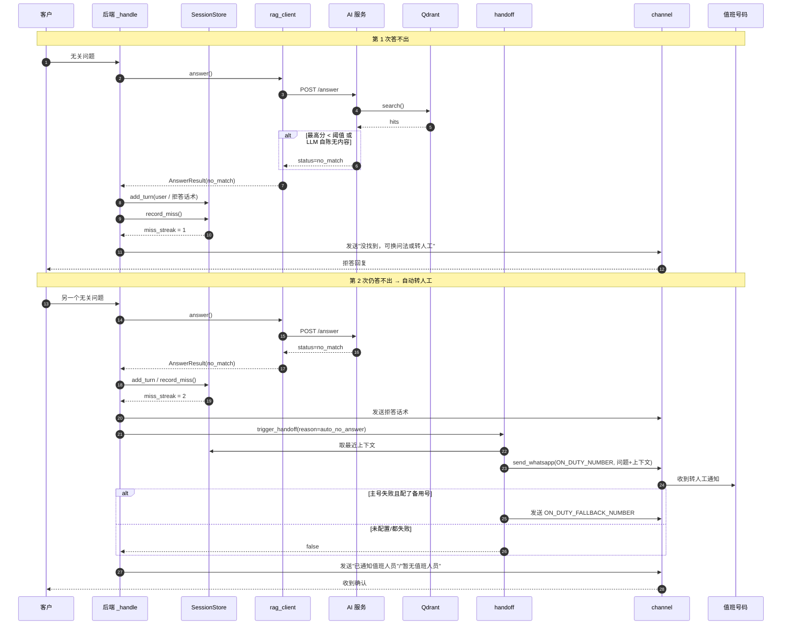
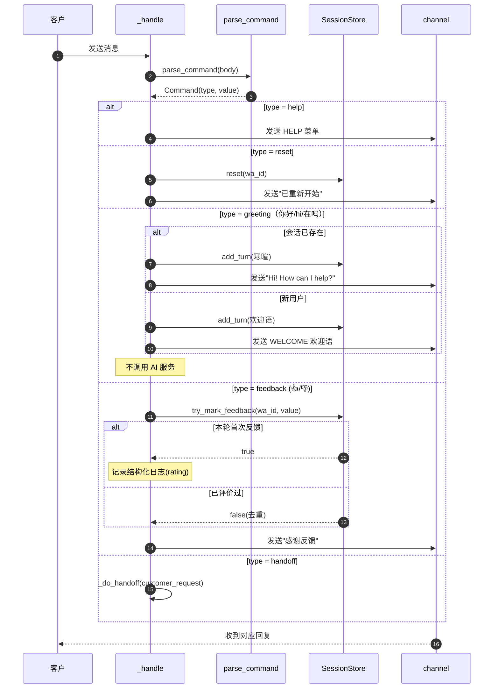
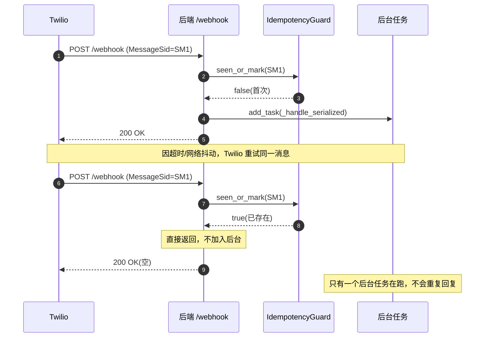
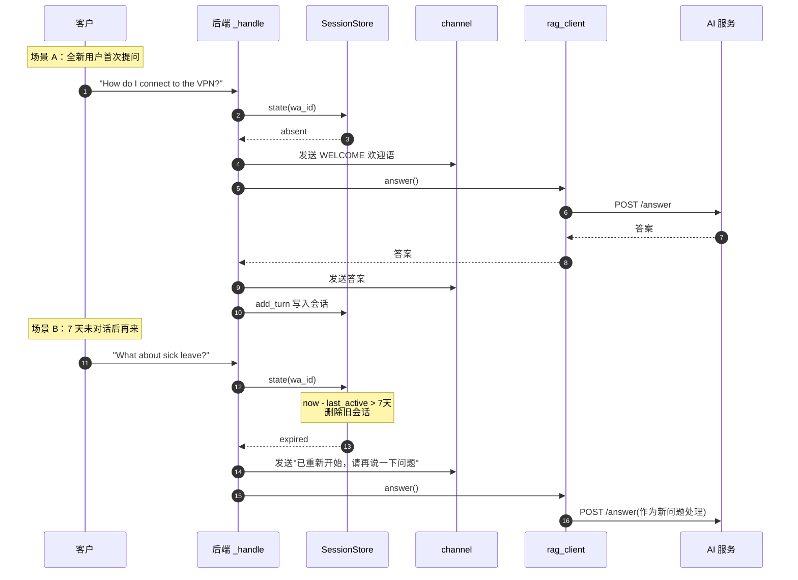
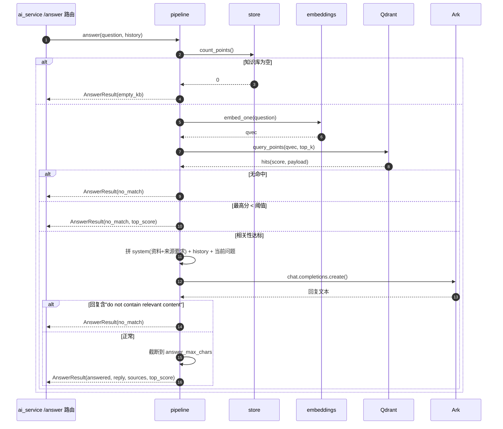
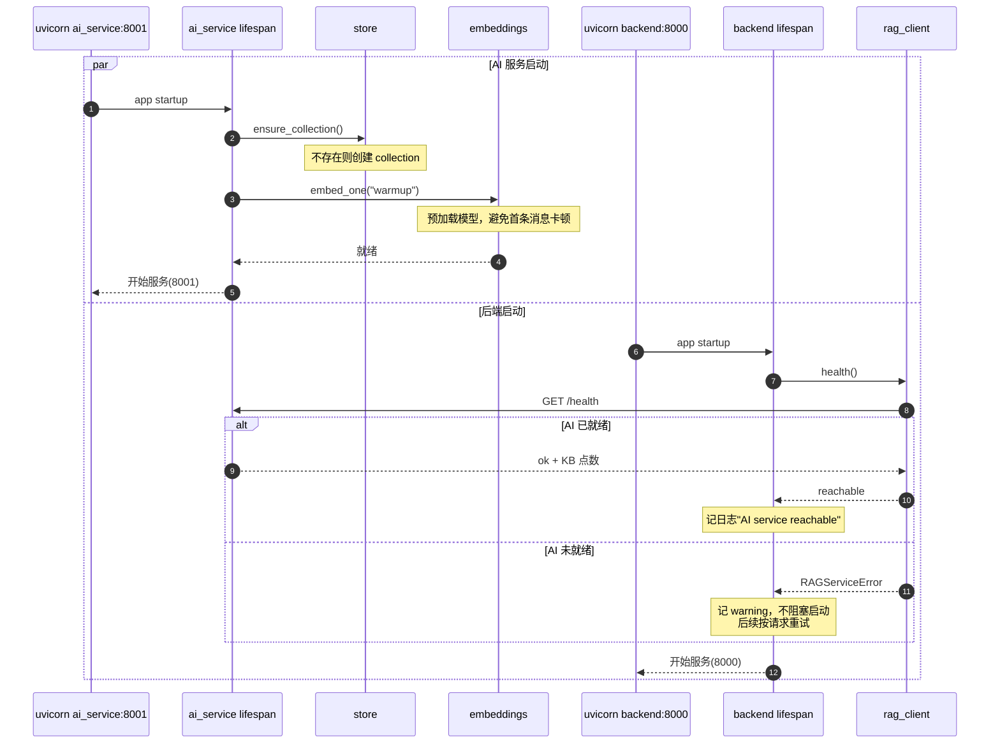
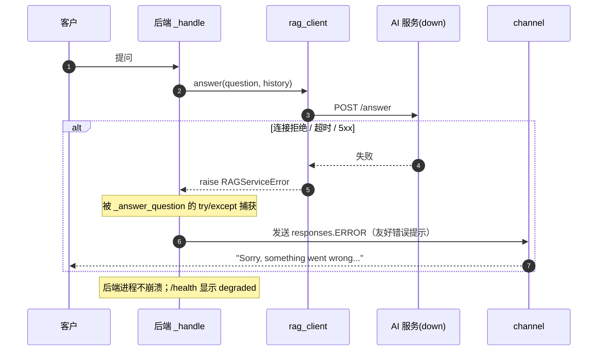

# WhatsApp 企业知识问答助手 — 时序图

本文档基于当前代码（[backend/app/main.py](../backend/app/main.py)、[backend/app/rag_client.py](../backend/app/rag_client.py)、[ai_service/app/main.py](../ai_service/app/main.py)、[ai_service/app/rag/pipeline.py](../ai_service/app/rag/pipeline.py)、[backend/app/handoff.py](../backend/app/handoff.py) 等）绘制核心流程的 Mermaid 时序图。

系统是**两个 FastAPI 服务**：

- **后端**（端口 8000）：webhook、幂等/限流、会话、指令、转人工、回发 WhatsApp。
- **AI 服务**（端口 8001）：embedding、Qdrant 检索、LLM 生成。
- 两者通过同步 HTTP（`POST /answer` 等）通信，是唯一耦合点。

流程要点：
- 同步阶段（webhook 内立即执行）：幂等检查，然后立即返回 HTTP 200。
- 后台阶段：同一用户在**用户锁内串行**处理：长度→限流→指令→会话→**HTTP 调 AI 服务**→回发。

---

## 1. 主流程：正常问答（命中知识库）

---

## 2. 无答案：拒答 + 连续 2 次自动转人工

---

## 3. 指令分支（帮助 / 重置 / 问候 / 反馈）

> 指令完全在**后端**处理，不调用 AI 服务。

---

## 4. 重复投递幂等（Twilio 重试）

---

## 5. 新用户欢迎与会话过期

---

## 6. RAG 内部时序（AI 服务 pipeline.answer）

---

## 7. 启动流程（两个服务各自 lifespan）

> 启动顺序建议：**先 AI 服务，后后端**；即使后端先启动也不会崩，只是 health 检查记一条 warning，每次请求时会重试。

---

## 8. AI 服务不可达时的降级

---

## 关键设计要点

- **webhook 立即 200**：所有耗时操作（HTTP 调用 AI 服务、LLM、回发）都在后台，避免 Twilio 超时重试。
- **同步幂等**：MessageSid 检查在加入后台任务之前完成，杜绝重复回复。
- **用户级串行锁**：同一用户的消息排队处理，防止并发导致重复欢迎语、会话错乱。
- **两道拒答防线**：检索分数低于阈值不调 LLM；LLM 自陈无内容也按拒答处理。
- **转人工三场景**（决策在 `handoff_policy.decide()`）：客户发 `agent` → 回复 `CONTACT_PHONE_NUMBER` 并（若配置）通知值班号；连续 `HANDOFF_MISS_THRESHOLD` 次答不出、连续 `HANDOFF_ERROR_THRESHOLD` 次 AI 服务报错/超时 → 回复联系电话，**不自动通知**值班人；回答了但 `top_score < LOW_CONFIDENCE_SCORE` 时只在答案后追加"回复 agent 联系人工"提示。
- **一次冷却**：`HandoffStore` 记录会话已给过联系方式，TTL 内或 reset 前后续失败只回普通兜底文案，不反复刷电话号码。
- **后端单 worker**：会话/幂等/限流/handoff 状态都在后端进程内存，必须 `--workers 1`。
- **故障隔离**：AI 服务挂了后端不崩，返回友好错误；`GET /health` 暴露降级状态。
- **契约边界**：两服务只通过 `/answer` 的 JSON 契约耦合，AI 内部（模型/切片/prompt/阈值）可独立演进。
