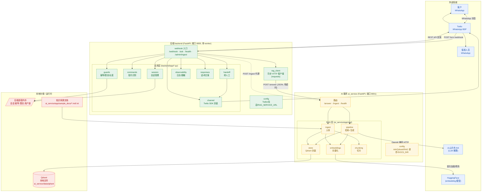
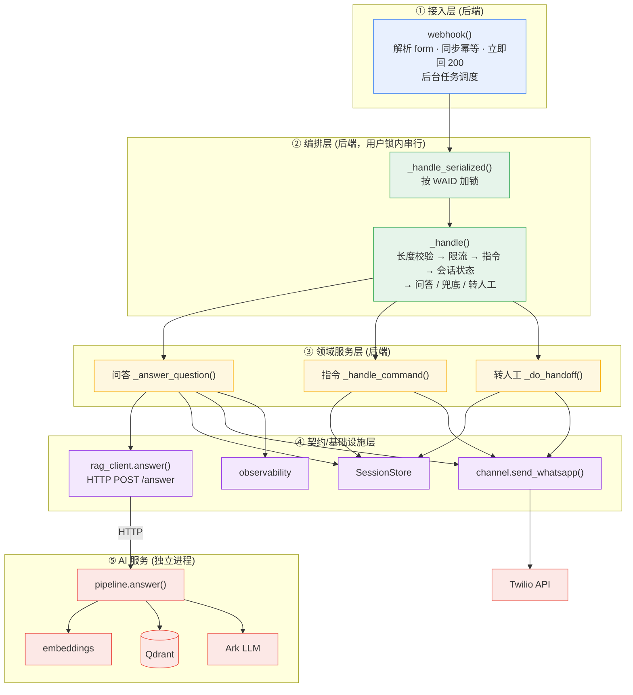
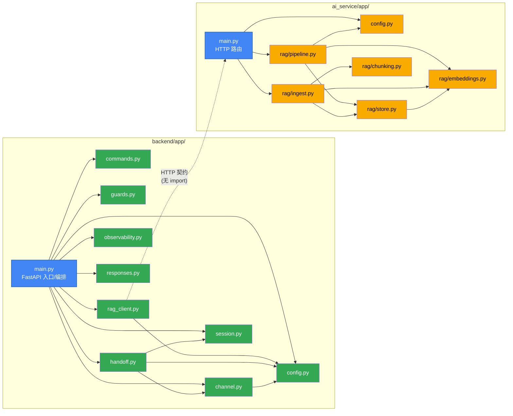
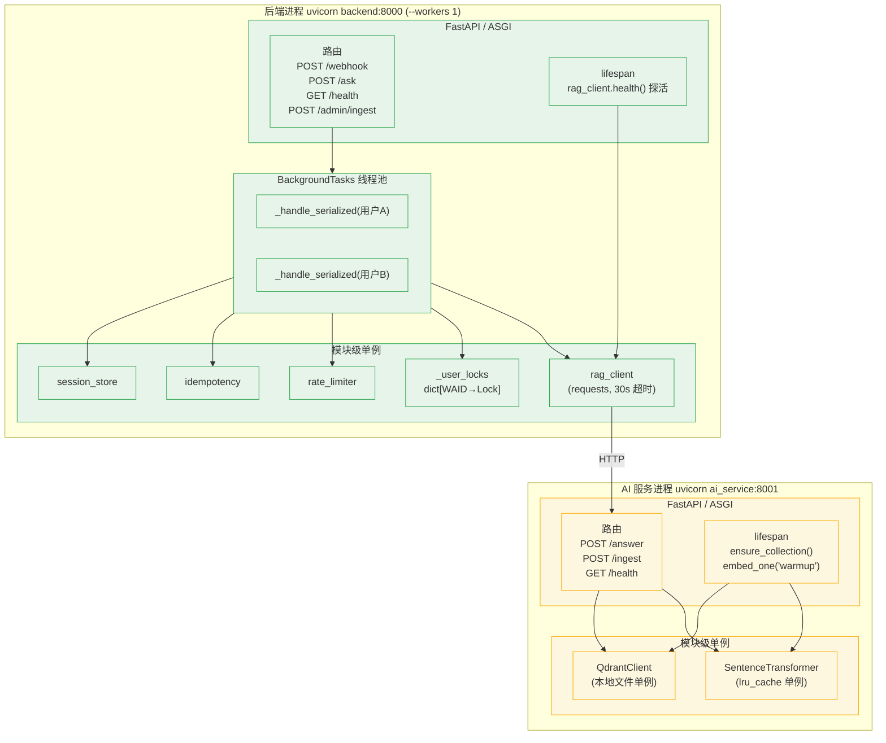
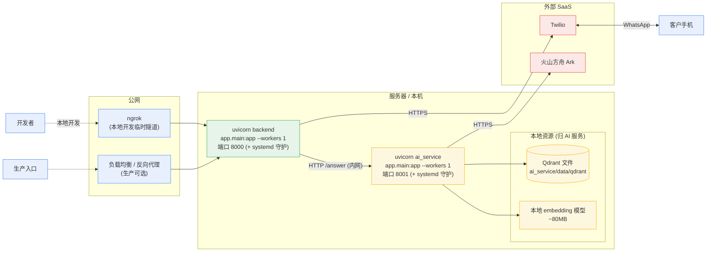
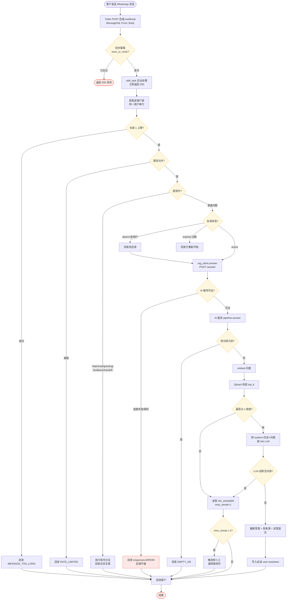

# WhatsApp 企业知识问答助手 — 架构图

本文档基于当前代码（`backend/` + `ai_service/` 两个 FastAPI 服务）绘制系统架构，使用 Mermaid 语法。配合 [时序图.md](时序图.md) 和 [开发决策与使用记录.md](开发决策与使用记录.md) 阅读。

2026-08-13 由单进程拆分为 monorepo 双服务，便于后端与 AI 两人分工。两服务唯一耦合是 `POST /answer` 的 HTTP/JSON 契约。

---

## 1. 总体架构（两个服务 + 外部依赖）



**边界说明**：
- 后端只依赖 Twilio、会话状态和 `rag_client`；**不直接依赖** Qdrant、embedding 模型或 Ark。
- AI 服务只拥有向量库、模型、知识库文档和 LLM 调用；**不感知** WhatsApp/会话。
- 后端同学与 AI 同学只需约定 `/answer` 契约即可并行开发。

---

## 2. 分层架构（请求处理路径）



---

## 3. 模块依赖关系（代码级，按服务）



> 说明：后端与 AI 服务之间**没有任何 Python import 关系**，只有 HTTP 调用。`guards.py`、`commands.py`、`responses.py`、`observability.py` 为纯逻辑模块，可独立测试。每个服务有自己的 `config.py` 作为该服务配置单一入口。

---

## 4. 进程内运行时结构

后端与 AI 服务是**两个独立的 uvicorn 进程**，各自持有模块级单例。



**关键点**：
- 后端的会话/幂等/限流/用户锁是**模块级单例**，所以后端必须 `--workers 1`；多 worker = 多份内存，去重/会话/限流会失效。
- AI 服务无会话状态（Qdrant client 和 embedding 模型是无状态共享资源），worker 数相对自由，1.0 仍用单 worker。
- 不同用户的后台任务可并行，但**同一用户的任务被用户锁串行化**。
- 后端通过 `rag_client` 同步调用 AI 服务，调用发生在后台线程内，不阻塞 webhook 的 200 响应。

---

## 5. 部署架构（1.0 本地单实例，两个进程）



**部署要点**：
- 两个进程分别启动、分别守护（systemd/supervisor）；任一崩溃由守护进程自动拉起。
- AI 服务只需在内网对后端可达，**不必**暴露公网。
- 后端 `.env` 放 Twilio 凭据和 `ON_DUTY_NUMBER`；AI 服务 `.env` 放 `ARK_API_KEY`——密钥分离。
- AI 服务挂掉时后端不崩，`/health` 返回 `degraded`，问答回友好错误提示。

**升级到多副本时**（未来 2.0）：后端把 `SessionStore`/`IdempotencyGuard`/`RateLimiter` 的内存实现换成 **Redis** 即可水平扩展；AI 服务把 Qdrant 从本地文件改为 **Qdrant server** 并加多副本。业务编排与 `/answer` 契约基本不动。

---

## 6. 数据流：一条消息的完整旅程



---

## 7. 目录结构

```text
whatsAppAgent/
├── backend/                         # 后端服务（端口 8000，后端同学负责）
│   ├── app/
│   │   ├── main.py                  # FastAPI 入口 + webhook 编排 + rag_client 调用
│   │   ├── rag_client.py            # 调 ai_service 的同步 HTTP 客户端（契约边界）
│   │   ├── config.py                # Twilio/会话/限流/转人工 + RAG_SERVICE_URL
│   │   ├── channel.py               # Twilio 收发封装
│   │   ├── session.py               # 会话管理（内存，TTL/轮数/截断/miss/反馈去重）
│   │   ├── guards.py                # 幂等、限流、长度校验
│   │   ├── commands.py              # 指令识别（help/reset/handoff/feedback/greeting）
│   │   ├── handoff.py               # 转人工：组装上下文 + 主/备值班号
│   │   ├── observability.py         # request_id、号码脱敏、结构化日志
│   │   └── responses.py             # 面向客户的话术文案（英文）
│   ├── tests/                       # pytest 单元测试（24 个，含 rag_client）
│   ├── requirements.txt             # fastapi/uvicorn/twilio/requests/python-dotenv
│   ├── .env.example                 # TWILIO_*, RAG_SERVICE_URL, SESSION_*, ON_DUTY_*
│   └── .env                         # 真实密钥（gitignore）
│
├── ai_service/                      # AI/RAG 服务（端口 8001，AI 同学负责）
│   ├── app/
│   │   ├── main.py                  # FastAPI 入口：/answer · /ingest · /health + 预热
│   │   ├── config.py                # Ark/Qdrant/chunk/top_k/threshold/DOCS_DIR
│   │   ├── rag/
│   │   │   ├── pipeline.py          # 检索 + 阈值 + 多轮 + LLM 生成（核心）
│   │   │   ├── embeddings.py        # 本地 sentence-transformers 向量化
│   │   │   ├── store.py             # Qdrant 封装（search/upsert/count/clear）
│   │   │   ├── chunking.py          # 文档切片
│   │   │   └── ingest.py            # 全量入库
│   │   └── sample_docs/             # 知识库源文档（中英 .md/.txt）
│   ├── scripts/ingest.py            # 命令行入库（需先停服，避免文件锁）
│   ├── tests/                       # pytest 单元测试（8 个，pipeline）
│   ├── data/qdrant/                 # Qdrant 本地数据（gitignore）
│   ├── requirements.txt             # fastapi/uvicorn/qdrant-client/sentence-transformers/openai
│   ├── .env.example                 # ARK_*, QDRANT_*, CHUNK_*, RAG_SCORE_THRESHOLD
│   └── .env                         # 真实密钥（gitignore）
│
├── specs/001-whatsapp-rag-assistant/   # Spec Kit 规格/计划/任务
├── docs/                            # 需求文档、决策记录、时序图、架构图（本文件）
└── README.md                        # 双服务说明与快速开始
```
