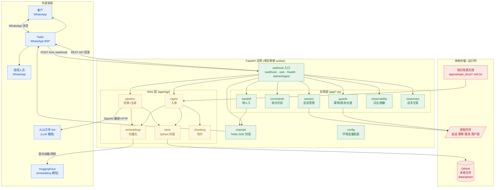
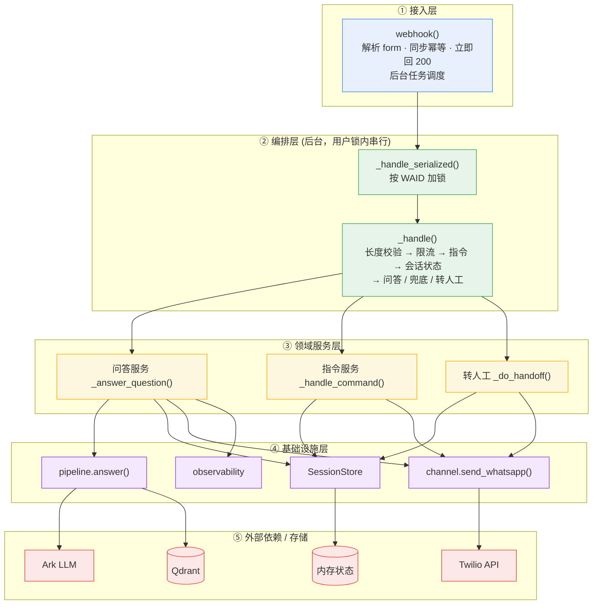
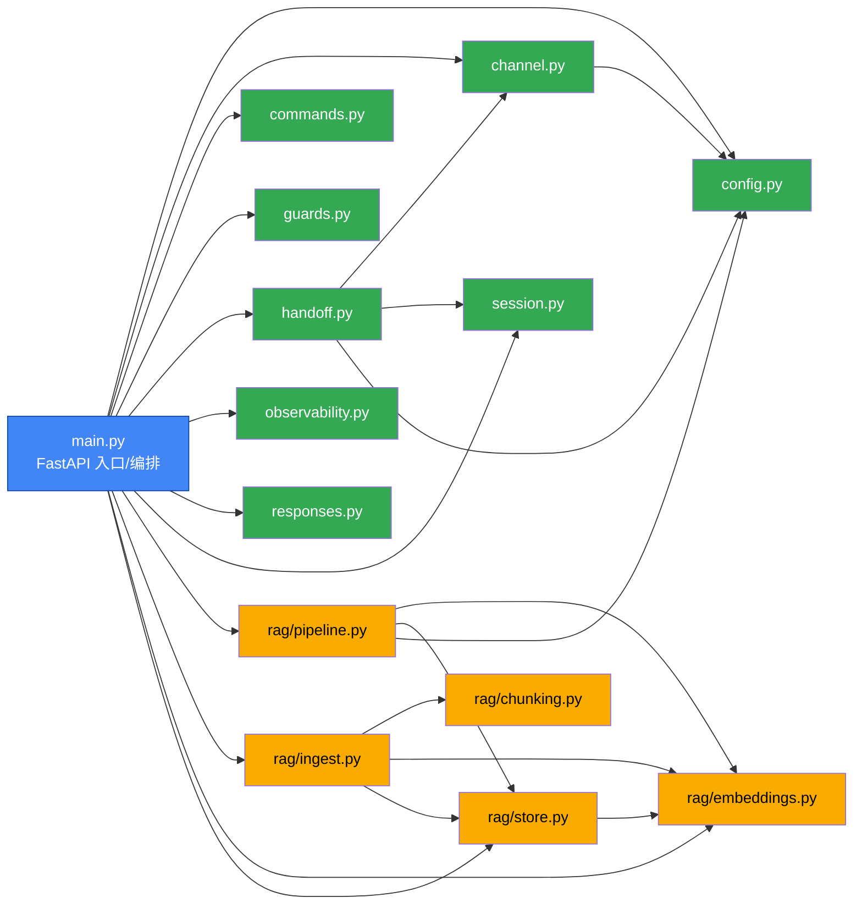
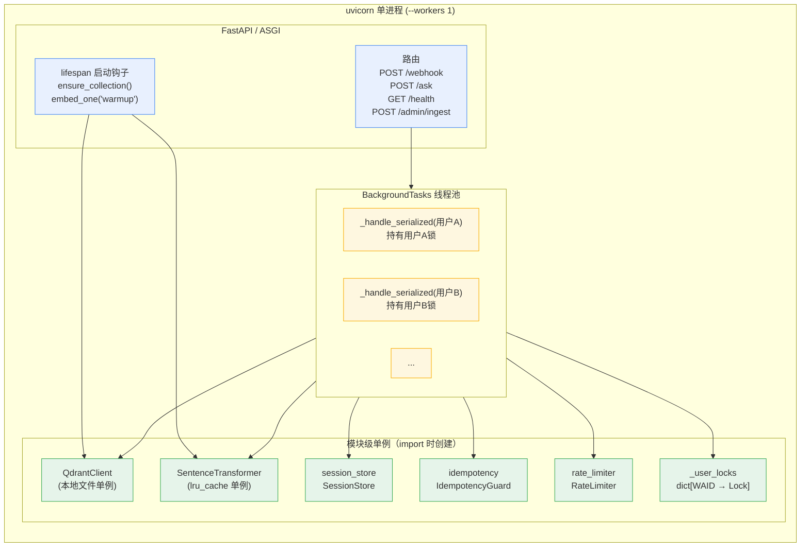
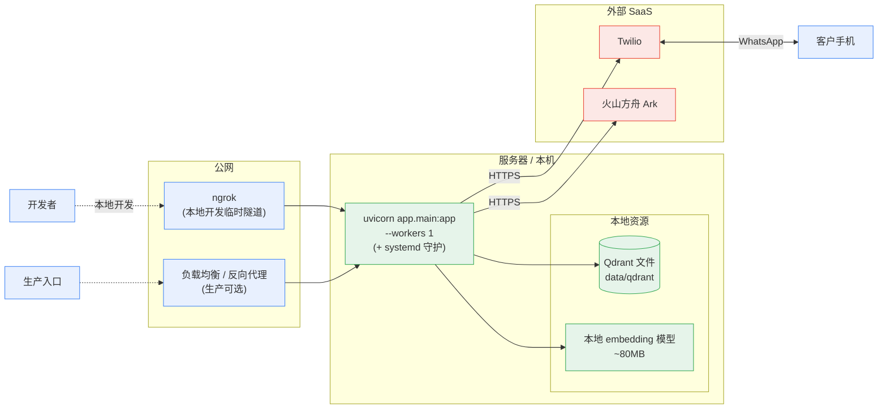
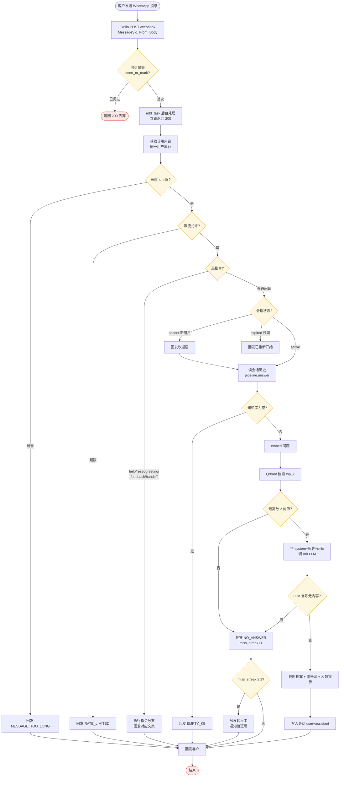

# WhatsApp 企业知识问答助手 — 架构图

本文档基于当前代码（`app/` 目录）绘制系统架构，使用 Mermaid 语法。配合 [时序图.md](时序图.md) 和 [开发决策与使用记录.md](开发决策与使用记录.md) 阅读。

---

## 1. 总体架构（组件与外部依赖）



---

## 2. 分层架构（请求处理路径）



---

## 3. 模块依赖关系（代码级）



> 说明：`guards.py`、`commands.py`、`responses.py`、`observability.py` 为纯逻辑模块，不依赖其他 app 模块，可独立测试。`config.py` 被几乎所有模块依赖，是配置单一入口。

---

## 4. 进程内运行时结构



**关键点**：
- 所有状态（会话、幂等、限流、用户锁、Qdrant client、embedding 模型）都是**模块级单例，在同一进程内共享**。
- 这就是为什么必须 `--workers 1`：多 worker = 多进程 = 多份内存，去重/会话/限流会失效。
- 不同用户的后台任务可并行，但**同一用户的任务被用户锁串行化**。

---

## 5. 部署架构（1.0 单实例）



**升级到多副本时**（未来 2.0）：把 `SessionStore`/`IdempotencyGuard`/`RateLimiter` 的内存实现替换为 **Redis**，把 Qdrant 从本地文件改为 **Qdrant server**，前面放负载均衡，FastAPI 副本变为无状态——业务编排层不需要改。

---

## 6. 数据流：一条消息的完整旅程



---

## 7. 目录结构

```text
whatsAppAgent/
├── app/
│   ├── main.py            # FastAPI 入口 + webhook 编排（接入层）
│   ├── config.py          # 环境变量配置（单一入口）
│   ├── channel.py         # Twilio 收发封装
│   ├── session.py         # 会话管理（内存，TTL/轮数/截断/miss/反馈去重）
│   ├── guards.py          # 幂等、限流、长度校验
│   ├── commands.py        # 指令识别（help/reset/handoff/feedback/greeting）
│   ├── handoff.py         # 转人工：组装上下文 + 主/备值班号
│   ├── observability.py   # request_id、号码脱敏、结构化日志
│   ├── responses.py       # 面向客户的话术文案
│   ├── rag/
│   │   ├── pipeline.py    # 检索 + 阈值 + 多轮 + LLM 生成（核心）
│   │   ├── embeddings.py  # 本地 sentence-transformers 向量化
│   │   ├── store.py       # Qdrant 封装（search/upsert/count/clear）
│   │   ├── chunking.py    # 文档切片
│   │   └── ingest.py      # 全量入库
│   └── sample_docs/       # 知识库源文档（.md/.txt）
├── tests/                 # pytest 单元测试（28 个）
├── scripts/ingest.py      # 命令行入库
├── specs/001-whatsapp-rag-assistant/   # Spec Kit 规格/计划/任务
├── docs/                  # 需求文档、决策记录、时序图、架构图（本文件）
├── data/qdrant/           # Qdrant 本地数据（gitignore）
├── .env                   # 真实密钥（gitignore）
├── .env.example           # 配置模板
└── requirements.txt
```
